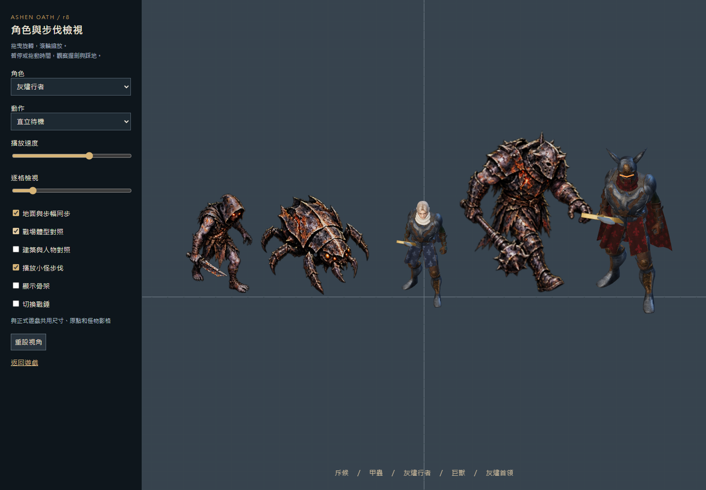
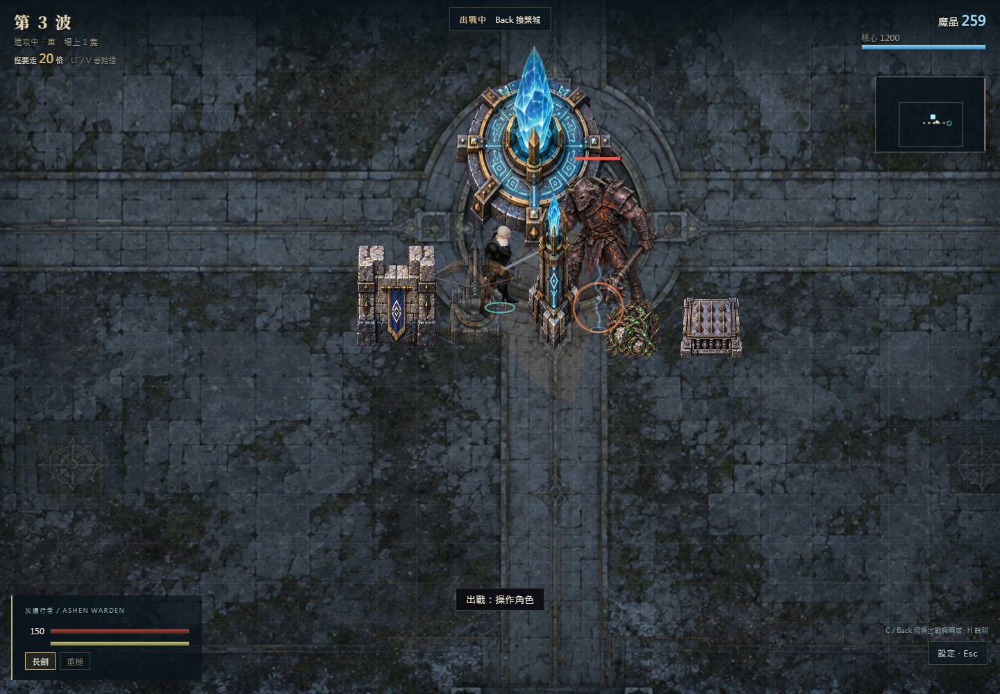

# 灰燼誓約：把整座戰場做成同一款遊戲

研究與重整決策稿 · 2026-09-27 · 基準版本 r8

**建議：先凍結零碎美術修補，製作一個美術、動作、空間與雙人玩法一致的「北門守城」小型關卡。通過正常遊戲鏡頭下的檢驗後，才擴充內容。**

前幾輪的責任在製作方法：把「能播放、沒有骨骼拉斷、測試通過」當成接近完成，卻沒有持續用同一個戰場畫面檢查整體。你的反覆不滿已經是重要的驗收結果。再放大小怪、修一張臉或增加火花，無法解決這個層級的問題。

這份研究重新閱讀你的完整背景提案，核對 r8 原始碼與既有 QA 截圖，並查閱開發者、官方手冊及美術規範。**沒有把這次研究說成真人遊玩測試，也沒有把參考作品的品質當作我們已經能達到的品質。** 本輪未修改遊戲原始碼、素材或執行中的 r8 版本。

## 01　應該做出什麼感受

你原始設定最有價值的核心是：「你設計出了值得利用的戰場，他把那個戰場的價值發揮出來。」

因此，成品要同時成立三件事：

- **戰鬥值得練習。** 玩家能看懂敵人、選擇防守方式，靠時機與武器差異變強。
- **城堡值得經營。** 路線、設施順序與關鍵指令能改變戰果，成功防禦換來真正的安全空檔。
- **合作留下共同成果。** 戰鬥者創造破綻，建設者安排火力；兩人都有個人成長，也看得見自己的貢獻。

這是後續取捨的標準。六種職業、龐大地圖、更多詞條與長達九十分鐘的局，都不能先於這三件事。

## 02　為什麼 r8 越修越不協調

以下把「可直接確認」與「設計判斷」分開。截圖來自既有 r8 QA；建築排列與巨獸圖是測試情境，不是自然發生的完整對局。總覽圖是築城鏡頭，不能拿它單獨判定出戰鏡頭是否合適。

### A. 同一張畫面有三套美術規則

人物與首領是打光後的 3D 骨架模型，再被畫到 Phaser 圖片；普通怪物和建築是已畫好陰影與透視的 2D 素材。人物會轉向，怪物主要左右翻圖，建築又有自己的視角。這是程式可以確認的事實。[本機 L1、L2、L3]

**我的判斷：** 問題在共同的造型、透視、光照與地面關係尚未成立。2D 與 3D 可以混用，但本版沒有把它們整合成同一套視覺規則。人物精修一點，反而更容易暴露與旁邊素材的差異。

### B. 動作流暢度與動作可信度是兩件事

三種小怪的 r8 步行由既有繪圖、指定關節點及三角網格變形產生 32 格；重槌攻擊仍選用名為 `Sword_Attack` 的劍動作。這些做法可以避免跳圖，卻沒有證明腳掌支撐、腰胯帶動、雙手握持與武器重量正確。[本機 L4、L5]

**我的判斷：** 小怪需要有立體方向與完整接地關係的動作；重槌需要相符的握法和全身發力。只增加影格、調整速度或把手貼到武器上，不足以達標。動作重定向仍需逐招修整，不能假設共用骨架就自然。

### C. 看得見的大小與能通行的空間分離

建築外觀可達 92–112 個世界單位寬，但尋路格仍是 40；這些是素材／規則數字，包含留白與造型，**不能直接當成真實底座寬度**。更明確的是，攻城模式目前明文允許角色跨過自己的牆與塔；玩家移動只使用地圖邊界限制。[本機 L6、L7]

**我的判斷：** 建築繼續變高變大，卻沒有同步處理底座、通道、遮擋與碰撞，會削弱整座城的實體感。城牆、門與戰鬥退路應一起設計；若保留可穿越規則，就應使用能清楚表達通行方式的設施，而不是看起來完全封閉的石牆。

### D. 細節很多，注意力沒有被安排好

目前戰場地面、怪物甲片、塔與核心都有密集紋理；測試畫面中的人物輪廓容易被淹沒。這是截圖觀察，不是量化的人因實驗。先前人物近景變好看，沒有證明正常戰鬥尺寸下更清楚。

**我的判斷：** 裝飾應讓位給接下來會傷到玩家的威脅。需要一起調整地面明暗、角色主色塊、敵人招式輪廓、遮擋與特效，而不是每個物件都做到最亮、最花。

### E. 已有合作規則，缺少讓人感受到它們的完整體驗

現有攻城模式已具備減速增傷、重槌破甲、咒術師打斷、巨獸破勢、符文與結界，值得保留；不能說目前完全沒有協作。選單仍分成決鬥、守城與攻城，教學、節奏與成果呈現尚需整合。[本機 L8、L9]

**待驗證假設：** 協作目前偏向數字乘算和模式功能，玩家未必能立即辨認「這次成功是我們配合造成的」。這不能靠機器人通關證明，要讓兩位真人實際玩、互換分工，再描述各自做了什麼。

## 03　研究哪些作品，具體學什麼

以下只使用官方或開發者資料。右欄是針對本專案的推論與提案，不是來源替我們驗證過的結論；沒有直接搬用他們的美術素材。

| 研究對象 | 官方資料能支持的重點 | 應用到灰燼誓約 |
| --- | --- | --- |
| Valve《Dota 2》角色美術規範 | 從俯視遊玩視角辨認輪廓、朝向，裝備需相容既有骨架與動畫。[S1] | 先用實際鏡頭檢查整組角色與建築；臉部與花紋放在輪廓成立之後。只借美術檢查方法。 |
| Riot《Clarity in League》 | 可讀性包含視聽訊息、重要性層級、降低雜訊；命中範圍與效果應相符。[S2] | 攻擊、受擊、塔命中與危險預兆共用清楚的視聽規則；大招以外不持續霸占畫面。 |
| Moon Studios《No Rest for the Wicked》 | 官方介紹強調繪畫風美術，商店描述強調有重量的精準戰鬥。[S3、S4] | 借鏡「有份量的黑暗奇幻」方向。不能因此推論使用高精度貼圖就能達成，也不仿製其獨特人物。 |
| 《仁王 2》官方介紹與測試回饋 | 殘心把回氣放進操作時機；架勢有不同攻擊用途。開發團隊也依測試調整追蹤、命中時機、受擊反應與狹窄處碰撞。[S5、S6] | 劍與槌要有不同風險、動作與回報；把判定和關卡空間一起測，不只驗證按鍵能觸發。 |
| Robot Entertainment《Orcs Must Die! Deathtrap》開發文 | 單人／多人調整不只血量，也包含多路敵人的到達間隔與波間準備；文中交代外部試玩。[S7] | 分別測單人和雙人注意力負荷；給建設者規劃時間，避免戰鬥者一直被迫中斷。這是 2024 年開發設計說明，不作為今日所有版本規則的保證。 |
| 《Thronefall》官方商店說明 | 白天建設、夜間防守，主打精簡的王國防禦循環。[S8] | 借清楚的階段與節奏，不把你的武器深度、自由防線和雙人合作一起簡化掉。它不是本案合作玩法的證據。 |

共同啟示是：**讓玩家理解並運用少量重要規則，比同時堆滿素材與功能更接近目前需要的進步。** 這是本研究的歸納，不是保證成功的公式。

## 04　確定一套共同的製作規格

### 美術與視角

建議採用**固定斜俯視、繪畫感的風格化 3D 黑暗奇幻**。人物、怪物、可互動建築與地面在同一個 3D 場景接受一致的投影、光照和接地陰影。UI、遠景與部分效果仍可用 2D。

這不是要求做成玩具小人。保留銀灰髮、象牙圍巾、深藍布料、磨損鋼甲與灰燼敵人的氣質；以整體剪影、肩胸比例、裝備層次與大面積材質做精緻感，減少正常鏡頭下只剩雜訊的刮痕。角色的好看需在八個方向、不同動作與正式背景上同時成立。

早期曾選側視 2.5D；目前守城原型與你完整背景的路線設計都使用平面移動。這次研究建議延續斜俯視以服務防線規劃，並不把「2.5D」當作固定側視的同義詞。若將來改成純橫向，應連同塔位、路線和雙人分工重新設計。

**首個比例基準（提案，尚未驗收）：** 以英雄實際站立高度 H 為單位，不使用圖片透明框尺寸。

| 對象 | 初始高度關係 | 判讀目的 |
| --- | --- | --- |
| 英雄 | 1 H | 正常戰鬥鏡頭仍看得出手、武器與腳掌 |
| 普通持械敵人 | 0.95–1.10 H | 具有威脅感，靠輪廓區別而非一律縮小 |
| 重甲菁英 | 約 1.4 H | 重量來自胸背、步態與受擊反應 |
| 關卡首領 | 1.7–1.9 H | 留足可閱讀的前搖與迴避空間 |
| 可通行門洞 | 至少約 1.35 H | 人物能合理通過；寬度另依碰撞與鏡頭校準 |
| 城牆與高塔 | 約 1.2–1.5 H／2–2.6 H | 高塔底座、射界與遮擋一起設計 |

所有物件在同一個比例測試場排列；相機先以約 35° 俯角作起點，整組一起測。這些值是可修改的起點，不是引用的業界標準。**高塔高度、底座寬度、碰撞範圍與通路是四個不同欄位，不能再用拉大圖片代替。**

### 顏色、光與特效

環境採低對比冷灰石材；我方以象牙白／深藍／舊黃銅建立辨識；敵人以焦黑甲殼與有限的熾紅裂紋構成家族。危險用清楚輪廓與節奏配合紅橙色，不能只靠顏色。友方符文光使用青色，但壓低待機發光，避免核心永遠搶走注意力。

畫面優先序：**即將命中的危險 → 可利用的破綻 → 玩家與隊友 → 防禦狀態 → 裝飾。** 普通塔射擊不使用全屏震動；重擊、格擋、彈反與破勢各有可辨認的受擊姿勢、短音色與效果形狀。音量混音先確保能聽到敵人前兆，再加入環境層。

### 動作、判定與手感

1. **先選相容的全身動作，再製作裝備。** 劍與槌分開製作握持、預備、發力、接觸、收勢；左手必須有清楚用途。雙手武器需要固定的第二握點及合理的肩肘活動。
2. **先校準接地，再增加披風等次要動作。** 腳落地、重心轉移、移動距離與播放相位一起檢查，包含起步、停止、轉向、倒退、持盾和碰牆。Unity 的 Root Motion 文件說明姿態和根位移是不同資料，足部高度也影響混合時的漂浮；這裡借用概念，不主張改用 Unity 或勾一個選項就能修好。[S9]
3. **建立共用招式資料。** 一招同時定義可轉向時間、前搖、有效傷害段、武器掃掠、收勢及可取消時機；伺服器判定與畫面都讀取同一套規格。用錄影疊加判定形狀核對，不以特效大小猜命中。
4. **連線與演出分清權責。** 保留權威模擬；攻擊位移曲線需供伺服器和客戶端共同取樣，不能讓客戶端動畫偷偷改變實際位置。一般移動先以實際速度匹配步幅。
5. **先看沒有特效的一招。** 能看清發力與命中後，再加入接觸音、短暫停頓、受擊與少量火花。目前已有演出停頓和震動，不需要盲目再加強。[本機 L10]

精準 IK、更多混合與動作捕捉都只能輔助；不合適的原始動作仍需重做。正式角色近景與自然動作若超出現有素材能力，必須用完整相容的資產製作／採購流程處理，不能再把不合格素材包裝成「已精修完成」。

## 05　下一個驗證關卡：北門守城

**目標是約 10–15 分鐘的可反覆遊玩小關卡，時間為設計目標。** 它先驗證局部核心；通過後才回到你原提案的 20–30 分鐘雙人循環，再考慮更長單局。

地圖只做一座有兩條入口的小要塞、一條短途遺跡岔路、一個可退守的內院。所有地方使用同一套建築和地面；主角、普通敵人、菁英及首領一起完成外觀基準，避免主角精修完才發現其他物件接不上。

| 段落 | 玩家實際做什麼 | 要看見的因果 |
| --- | --- | --- |
| 抵達與準備 | 自由試劍、槌、格擋與翻滾；選擇把兩路導向一處，或布成前後兩道防線 | 看得懂入口、門、塔位與安全區，雙方就緒才開第一波 |
| 試探波 | 防線清理普通敵人；戰鬥者攔截一名突出威脅 | 塔有效，手動操作也有需要，無須每隻小怪精準彈反 |
| 安全窗口 | 一人調整防線；另一人可去短途遺跡處理菁英，也可兩人同行 | 遠征提供個人武器選項與另外的基地資源，不搶同一份獎勵 |
| 最後攻勢 | 引導重甲敵人進入減速區，槌擊破甲，重弩取得輸出窗口；建設者決定結界使用時機 | 一條清楚的合作鏈，仍容許靠其他布局與戰鬥方式完成 |
| 守住北門 | 留下城堡旗幟／戰役紀錄，回顧哪段防線成功、哪次破勢救場 | 看見自己的貢獻，也有改配置再玩一次的理由 |

**範圍固定：** 劍與重槌；兩種普通威脅（斥候、重甲兵）；一名菁英兼關卡首領，使用不同遭遇配置；牆／門、重弩、減速陷阱、一道主動結界。兩種有效布局為「集中火力通道」與「分層退守」。不在這一關加入六職業、完整裝備刷取、四種建設派系或無限地圖。

兩種武器先各做清楚的基本與重擊選擇；獨立架勢選單等基本武器差異通過後再加。劍負責探招、防守與追擊，槌負責承擔較長動作風險換取破甲。切換要產生選擇，不能無條件清掉所有收勢。

建設者戰時有少量重要決定，無須逐塔補彈。戰鬥者不靠最後一擊獨占收益。單人保有設施自動運作與更寬裕的敵人到達間隔；雙人增加協同壓力，而非只加生命值。準備完成與警報時間要明示，不因有人走進遺跡就突然觸發懲罰攻城。

## 06　技術重整與保留範圍

**目前建議先保留 TypeScript／Colyseus 規則和輸入，把戰場呈現集中到單一 Three.js 場景。** 這是依現有程式提出的工程路線，尚未完成效能原型；不是宣稱瀏覽器一定能負擔最終規模。Phaser 可以先保留 UI，但逐步退出人物轉圖集再貼回戰場的流程。

選擇原因：新呈現層可直接接現有狀態，先檢驗是否能建立同一個空間；現在立即換整個引擎，會同時重寫已可用的連線、手把與規則，仍然不能自動獲得好模型和好動畫。

| 處理 | 內容 | 完成條件 |
| --- | --- | --- |
| 保留並再校準 | 雙人連線、Xbox 輸入、戰鬥狀態機、塔與敵人的協作效果、回歸測試 | 新呈現層下輸入、判定、同步仍一致 |
| 優先重做 | 共用相機與地面、人物／敵人造型標準、武器動作、建築底座與遮擋 | 全組在同一實戰鏡頭成立 |
| 逐步替換 | 單畫面變形小怪、人物轉圖片的戰場管線、任意圖片縮放規則 | 至少一波敵人、一組防線、一場近戰實際通過 |
| 重新設計 | 玩家與己方牆體碰撞、門與逃生路；模式間引導與成果呈現 | 建築有體積但不把玩家卡死，合作因果能被玩家說明 |
| 暫緩 | 更多職業、更多首領、更多特效、整張世界、長局進程 | 北門關卡通過真人試玩後才排入 |

建築碰撞是玩法變更，不能單獨上線：門洞、逃生通道、建造合法性、敵我尋路與伺服器驗證需要一起做，先在獨立原型測試。美術模型建立真實底座後，尋路與放置使用該底座；視覺塔頂不能被誤當成障礙寬度。

**效能先設停止點：** 在同一測試機、1080p、兩位玩家、24 名活動小怪、1 名首領、12 個防禦設施的提案壓力場景，記錄中位與第 95 百分位幀時間、GPU／CPU、同步及輸入延遲；以穩定接近 60 fps 為起始目標。數量與目標是本案的驗證配置，尚未測得。若需要依靠縮小主要角色、砍掉關鍵受擊訊息才能維持，先處理模型／材質批次和場景預算；仍無法成立再評估引擎遷移。

## 07　製作順序與驗收門檻

每一步都有可看的成果；前一步不過，不靠新增內容掩蓋。

| 次序 | 可檢查成果 | 通過方式 |
| --- | --- | --- |
| 1　統一場景基準 | 一名英雄、普通兵、菁英、首領、牆、門、塔、地面，放在同一相機 | 在 720p／1080p 的實際玩法尺寸看剪影、朝向、接地與通路；近景檢查只作補充 |
| 2　做完整動作組 | 劍／槌的待機、移動、出手、受擊、格擋、翻滾、收勢 | 逐格及正常速度看八方向；檢查雙手、支撐腳、轉向、停步與窄路，不只檢查骨骼是否有限值 |
| 3　做一場好打的遭遇 | 一位玩家、一名敵人、一套清楚的招式與反制 | 打空、被擋、命中、破勢各看得懂；畫面接觸與判定疊圖一致；鍵鼠與 Xbox 都測 |
| 4　把防線接進去 | 兩個布局、兩種武器、同一場攻勢 | 能指出哪個位置／哪次破勢改變結果；不能只比較總傷害 |
| 5　完整小關卡 | 準備、試探、遠征、攻城、共同成果 | 兩位真人互換偏重工作各玩一次，再自行選布局重玩；記錄中斷、困惑與自主選擇 |

真人觀察先回答六個問題：能否立即找到自己與最近威脅？受傷後能否說出原因？劍和槌是否真的需要不同判斷？建設者有無有意義但不繁瑣的戰時操作？一人是否常在等另一人？是否想為了改布局／換打法再玩一次？

**重要區別：** 自動測試驗證「功能正確」；逐招檢查驗證「演出可信」；真人試玩才提供「有沒有樂趣」的證據。三者都需要，不能互相代替。小樣本只用來找明顯問題，不虛構滿意度、轉換率或成功概率。

## 08　可追溯來源與本機證據

查閱日期均為 2026-09-27。歷史開發文章用來理解當時的設計方法，沒有推論其最新版本所有細節。下列連結支撐的範圍有限；比例、關卡長度、效能場景和驗收程序均為本案提案。

- **S1** [Valve：Dota 2 Workshop — Character Art Guide](https://help.steampowered.com/en/faqs/view/0688-7692-4D5A-1935)。支持俯視辨識、剪影、朝向與骨架相容；本次官方搜尋索引能讀到此段，直接頁面文字擷取有限，未擴張引用不可讀的段落。
- **S2** [Riot：Clarity in League](https://www.leagueoflegends.com/en-au/news/dev/clarity-in-league/)，2021-03-12。支持可讀性、視聽層級、雜訊控制與效果／命中範圍一致。
- **S3** [Moon Studios：Introducing No Rest for the Wicked](https://norestforthewicked.com/news/introducing-no-rest-for-the-wicked)，2023-12-08。支持其自述繪畫風方向。
- **S4** [No Rest for the Wicked：官方 Steam 商店](https://store.steampowered.com/app/1371980/No_Rest_for_the_Wicked/)。支持精準、有重量的戰鬥定位；未引用價格、銷量或評分。
- **S5** [Sony Interactive Entertainment：Survive Nioh 2’s Opening Hours with 9 Gameplay Tips](https://blog.playstation.com/2020/03/11/survive-nioh-2s-opening-hours-with-9-gameplay-tips/)，2020-03-11。支持殘心、架勢與不同武器用途。
- **S6** [Team NINJA：Nioh 2 Beta Demo Survey Results](https://www.gamecity.ne.jp/nioh2/trial-result-en.html)。支持依玩家回饋修改動作、命中、難度與關卡碰撞。
- **S7** [Robot Entertainment：Solo and Multiplayer Balancing](https://robotentertainment.com/news-archive/2024/8/27/6yndnw72net5asysm6nwsyli4os3lq)，2024-08-28。支持敵人到達間隔、波間準備與單雙人分別測試；沒有移植其數值。
- **S8** [Thronefall：官方 Steam 商店](https://store.steampowered.com/app/2239150/Thronefall/)。支持白天建設／夜間防守及精簡定位；沒有把它當合作遊戲。
- **S9** [Unity 6：How Root Motion works](https://docs.unity3d.com/6000.0/Documentation/Manual/RootMotion.html)。支持根位移、姿態與足部高度的技術概念；不構成引擎選型結論。

本機證據以 `D:/CODEX/AshenKeep/game/` 為基準。隨附 `evidence/local-code.json` 保存相關程式片段及檔案 SHA-256，供之後版本變動時比對。

| 編號 | 檔案與位置 | 核對內容 |
| --- | --- | --- |
| L1 | `client/src/livingActor.ts:12` | 3D 模型先渲染至 2×2 圖集，再交 Phaser 畫面使用 |
| L2 | `client/src/skeletalActor.ts:129` | 3D 角色有自己的光源與正交相機 |
| L3 | `client/src/keepScene.ts:512` | 小怪以左右翻圖和逐格素材表現移動 |
| L4 | `art-source/tools/visual-r8/build_mobs.py:54` | 三種小怪、Delaunay 網格與 32 格循環 |
| L5 | `client/src/skeletalActor.ts:60` | 重槌攻擊選用 Sword_Attack |
| L6 | `client/src/actorScale.ts:15`、`shared/keep_config.ts:7` | 建築顯示尺寸與 40 單位尋路格 |
| L7 | `shared/siege_config.ts:12`、`server/siegeWorld.ts:469`、`client/src/siegeScene.ts:127` | 玩家跨己方建築的明文規則及共用邊界限制 |
| L8 | `shared/siege_config.ts:1`、`shared/keep_config.ts:48` | 已有的戰鬥與防禦交互效果 |
| L9 | `client/src/main.ts:18` | 決鬥／守城／攻城三模式 |
| L10 | `client/src/impactProfile.ts:1` | 已有演出停頓、反應、震動，模擬不隨之停止 |

原始背景來自你提供的「貼上的文字.txt」；視為需求與設計提案，不拿其中提到的遊戲描述代替外部事實查證。既有 QA 的通過數不在本報告中轉述為美術、人體動作或好玩的證明。

**下一份應交付的可玩成果：同一個正式視角下、同一套美術規格的北門小關卡。** 研究文件本身不等於遊戲已改善；成果要以實際操作與雙人選擇來驗收。
