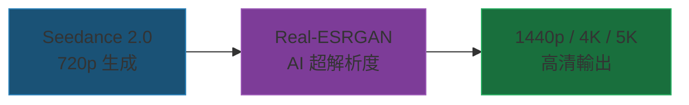

# Seedance 2.0 實戰筆記

從 Prompt Skill 到影片超解析度

<div class="pt-8">
  <span class="text-gray-400">Prompt Engineering × 超解析度 × Threads 爬蟲</span>
</div>

<div class="abs-br m-6 text-gray-500 text-sm">
  2026-05-26
</div>

---
layout: default
---

# 目錄

<div class="grid grid-cols-2 gap-8 mt-8">

<div class="border border-gray-600 rounded-lg p-6 hover:border-blue-400 transition">
  <div class="text-3xl mb-2">📷</div>
  <h3 class="text-xl font-bold">Ch.1 開源 Prompt Skill</h3>
  <p class="text-gray-400 text-sm">兩個 GitHub repo 教會我什麼</p>
</div>

<div class="border border-gray-600 rounded-lg p-6 hover:border-green-400 transition">
  <div class="text-3xl mb-2">✍️</div>
  <h3 class="text-xl font-bold">Ch.2 Prompt 進化</h3>
  <p class="text-gray-400 text-sm">學習前 vs 學習後的差異</p>
</div>

<div class="border border-gray-600 rounded-lg p-6 hover:border-yellow-400 transition">
  <div class="text-3xl mb-2">🔬</div>
  <h3 class="text-xl font-bold">Ch.3 720p vs 1080p</h3>
  <p class="text-gray-400 text-sm">為什麼低解析度反而更好</p>
</div>

<div class="border border-gray-600 rounded-lg p-6 hover:border-red-400 transition">
  <div class="text-3xl mb-2">🕷️</div>
  <h3 class="text-xl font-bold">Ch.4 Threads 爬蟲</h3>
  <p class="text-gray-400 text-sm">繞過限制的方法與應用</p>
</div>

</div>

---
layout: section
---

# Ch.1 兩個開源 Prompt Skill 學到什麼

---

# MapleShaw / seedance2.0-prompt-skill

<a href="https://github.com/MapleShaw/seedance2.0-prompt-skill" target="_blank" class="text-blue-400 text-sm">github.com/MapleShaw/seedance2.0-prompt-skill</a>

定位：**創意總監型** — 先問再做、引導式對話

<div class="grid grid-cols-2 gap-6 mt-4">

<div>

### 📷 相機四維編碼

```
一個鏡頭 = Z距離 + Y高度 + X方位 + F濾鏡
```

| 維度 | 控制 | 範圍 |
|---|---|---|
| **Z** | 景別 | Z1 大特寫 → Z9 大遠景 |
| **Y** | 仰俯 | Y1 蟲視 → Y7 頂視 |
| **X** | 方位 | X1 正面 → X4 背面 |
| **F** | 鏡頭 | 焦段 + 景深 + 畸變 |

</div>

<div>

### ✂️ 六套剪輯公式

| 公式 | 節奏 | 適合 |
|---|---|---|
| 呼吸式 | 快快慢～ | 80% 日常 |
| 心跳式 | 咚哒咚哒 | 懸疑運動 |
| 海浪式 | 小→大→平靜 | 情感 MV |
| 子彈時間 | 慢→砰！爆發 | 高潮段 |
| 脈衝式 | 哒哒哒→轟！ | 預告片 |
| 靜默錘擊 | 安靜…砰！ | 奢侈品 |

</div>

</div>

---

# dexhunter / seedance2-skill

<a href="https://github.com/dexhunter/seedance2-skill" target="_blank" class="text-blue-400 text-sm">github.com/dexhunter/seedance2-skill</a>

定位：**工具書型** — 語法表 + 模板庫、即查即用

<div class="grid grid-cols-2 gap-6 mt-4">

<div>

### @ 引用語法（13 種角色）

| 用途 | 語法 |
|---|---|
| 首幀 | `@圖片1 作為首幀` |
| 角色外觀 | `@圖片1 的角色為主體` |
| 場景背景 | `場景參考 @圖片3` |
| 運鏡複刻 | `參考 @視頻1 的運鏡` |
| 動作複刻 | `參考 @視頻1 的動作` |
| 特效複刻 | `完全參考 @視頻1 的特效` |
| BGM | `背景音樂參考 @音頻1` |
| 服裝 | `穿 @圖片2 的服裝` |

</div>

<div>

### 10 類 Prompt 模板

1. 角色一致性控制
2. 運鏡/動作複刻
3. 創意/特效複刻
4. 視頻延長
5. 視頻編輯（角色替換）
6. 音樂卡點
7. 對白與配音
8. 一鏡到底
9. 電商產品展示
10. 科普教育

</div>

</div>

---

# 兩個 Skill 的互補關係

<div class="grid grid-cols-2 gap-8 mt-6">

<div class="border-l-4 border-blue-500 pl-6">

### 🎬 MapleShaw = 創意總監

- 引導式三條路徑（短片/長片/圖片驅動）
- 相機四維座標系統 Z/Y/X/F
- 長片 25 格生產流水線
- 六套剪輯公式 + AI 素材對策
- 深度美學約束（Octane 級渲染詞）
- **適合**：大案子、系統性創作

</div>

<div class="border-l-4 border-green-500 pl-6">

### 📖 dexhunter = 參考手冊

- @ 引用語法完整表格
- 10 類 prompt 模板即查即用
- 常見錯誤清單
- 英中雙語
- 原生 Claude Code 安裝
- **適合**：日常快速查找、直接套模板

</div>

</div>

<div class="mt-6 text-center text-gray-400">

兩個都裝：`seedance-prompt-zh`（MapleShaw）+ `seedance-prompt-en`（dexhunter）

</div>

---
layout: section
---

# Ch.2 學習前 vs 學習後的 Prompt

---

# ❌ 學習前的 Prompt

<div class="mt-4 bg-red-900/30 border border-red-700 rounded-lg p-6">

```
台灣熱炒店場景，一個男上司拿筷子指著魚對女下屬說話，
女下屬生氣把魚砸在他臉上，男的被砸飛撞牆壁，
站起來說我只是想吃巴沙魚。搞笑風格，15秒。
```

</div>

<div class="grid grid-cols-3 gap-4 mt-6">

<div class="text-center">
  <div class="text-3xl">❌</div>
  <div class="text-sm text-red-400">沒有時間戳分鏡</div>
  <div class="text-xs text-gray-500">模型不知道何時做什麼</div>
</div>

<div class="text-center">
  <div class="text-3xl">❌</div>
  <div class="text-sm text-red-400">沒有鏡頭語言</div>
  <div class="text-xs text-gray-500">全靠模型自由發揮</div>
</div>

<div class="text-center">
  <div class="text-3xl">❌</div>
  <div class="text-sm text-red-400">沒有 @ 引用</div>
  <div class="text-xs text-gray-500">角色只靠文字描述</div>
</div>

<div class="text-center">
  <div class="text-3xl">❌</div>
  <div class="text-sm text-red-400">沒有音效指示</div>
  <div class="text-xs text-gray-500">環境音全隨機</div>
</div>

<div class="text-center">
  <div class="text-3xl">❌</div>
  <div class="text-sm text-red-400">台詞混在描述裡</div>
  <div class="text-xs text-gray-500">沒有情緒標注</div>
</div>

<div class="text-center">
  <div class="text-3xl">❌</div>
  <div class="text-sm text-red-400">沒有禁止項</div>
  <div class="text-xs text-gray-500">可能出現文字浮水印</div>
</div>

</div>

---

# ✅ 學習後的 Prompt

<div class="mt-2 bg-green-900/20 border border-green-700 rounded-lg p-4 text-xs leading-relaxed">

```
台灣熱炒店夜間公司聚餐，暖黃燈光混雜霓虹，手持攝影微晃感，寫實都市喜劇質感，

@圖片1的男性角色為男上司，@圖片2的女性角色為女下屬，
桌上擺滿台式熱炒，上司正前方有一大盤紅燒全魚，旁邊散落台灣啤酒瓶。

0-3秒：Medium Shot 中景拍攝聚餐桌面，上司拿筷子得意地指著紅燒魚，
  嘴角帶曖昧笑容——台詞（男上司，油膩台灣國語）："魚是好魚，就是刺多"
  環境音鍋鏟翻炒聲和杯盤碰撞；

4-6秒：Cut 到女下屬臉部 Close-Up，表情從困惑瞬間轉為暴怒，猛地站起來
  雙手端起整盤紅燒魚——台詞（女下屬，暴怒）："你他媽吃個魚也要機機掰掰！"
  Whip Pan 甩鏡魚盤砸向上司面門，醬汁飛濺；

7-10秒：Wide Shot 全景，上司被魚砸到後誇張地往後彈射飛出，撞穿牆壁
  形成人形大洞，碎石粉塵四散，慢動作捕捉撞牆瞬間；

11-15秒：Low Angle 仰拍，上司從碎石堆中灰頭土臉站起來——
  台詞（男上司，委屈像被冤枉的小孩）："我只是想吃巴沙魚……"

禁止：任何文字、字幕、LOGO、水印
```

</div>

---

# Before vs After 差異總結

<div class="mt-4">

| 維度 | ❌ Before | ✅ After |
|---|---|---|
| **時間控制** | 完全沒有 | `0-3s` / `4-6s` / `7-10s` / `11-15s` 精確分鏡 |
| **鏡頭語言** | 不存在 | Medium Shot / Close-Up / Whip Pan / Wide Shot / Low Angle |
| **角色引用** | 純文字「一個男上司」 | `@圖片1` `@圖片2` 三視角角色設定圖 |
| **音效設計** | 沒有 | 鍋鏟翻炒聲 / 砸臉撞擊聲 / 牆壁崩塌碎裂聲 |
| **台詞格式** | 混在描述裡 | `台詞（角色，情緒）："內容"` 獨立標注 |
| **風格總綱** | 「搞笑風格」四個字 | 暖黃燈光 + 手持攝影微晃感 + 寫實都市喜劇 |
| **禁止項** | 沒有 | 禁止文字 / 字幕 / LOGO / 水印 |

</div>

<div class="mt-4 text-center">

> 從「寫作文」進化到「寫分鏡腳本」

</div>

---
layout: section
---

# Ch.3 720p vs 1080p

為什麼低解析度反而更穩定？

---

# 實測結果

<div class="mt-6">

用 **完全相同的 prompt** + **同樣的角色參考圖** 分別生成：

</div>

<div class="grid grid-cols-2 gap-8 mt-6">

<div class="border border-green-500 rounded-lg p-6 bg-green-900/20">
  <div class="text-center text-2xl font-bold text-green-400">720p ✅</div>
  <div class="text-center text-sm text-gray-400 mt-1">1280 × 720</div>
  <ul class="mt-4 text-sm">
    <li>✅ 動作連貫性佳</li>
    <li>✅ 角色一致性高</li>
    <li>✅ Prompt 遵循度好</li>
    <li>✅ 分鏡轉場自然</li>
  </ul>
</div>

<div class="border border-red-500 rounded-lg p-6 bg-red-900/20">
  <div class="text-center text-2xl font-bold text-red-400">1080p ❌</div>
  <div class="text-center text-sm text-gray-400 mt-1">1920 × 1080</div>
  <ul class="mt-4 text-sm">
    <li>❌ 動作斷裂、不連貫</li>
    <li>❌ 角色臉部飄移</li>
    <li>❌ 部分分鏡被忽略</li>
    <li>❌ AI 破綻更明顯</li>
  </ul>
</div>

</div>

---

# 為什麼？四個核心原因

<div class="mt-4">

### 1️⃣ 算力稀釋效應

```
1080p = 1920 × 1080 = 2,073,600 像素/幀
 720p = 1280 ×  720 =   921,600 像素/幀
                         ───────
                         2.25 倍差距
```

同樣的推理預算，1080p 要填 **2.25 倍像素** → 每個像素分到的「注意力」更少

### 2️⃣ 原生訓練解析度

模型在 **720p 或更低**解析度上訓練。1080p 靠超解析度模組硬拉，不是原生生成。

### 3️⃣ 恐怖谷效應

720p 輕微模糊 → **掩蓋 AI 破綻**（手指畸變、臉部微抖）。1080p 全部放大。

### 4️⃣ 複雜 Prompt 的天花板

4 個分鏡 + 2 段台詞 + 撞牆物理效果 → 720p 剛好能處理，1080p 力不從心。

</div>

---

# 最佳策略：720p 生成 → 後期超解析度

<div class="mt-4 text-center">



</div>

<div class="grid grid-cols-3 gap-4 mt-6">

<div class="text-center border border-gray-600 rounded p-4">
  <div class="text-lg font-bold">720p 原始</div>
  <div class="text-gray-400 text-sm">1280 × 720</div>
  <div class="text-green-400 text-xs mt-1">~6 MB</div>
</div>

<div class="text-center border border-blue-600 rounded p-4">
  <div class="text-lg font-bold">2x → 1440p</div>
  <div class="text-gray-400 text-sm">2560 × 1440</div>
  <div class="text-blue-400 text-xs mt-1">18.4 MB</div>
</div>

<div class="text-center border border-purple-600 rounded p-4">
  <div class="text-lg font-bold">4x → 5K</div>
  <div class="text-gray-400 text-sm">5120 × 2880</div>
  <div class="text-purple-400 text-xs mt-1">54.3 MB</div>
</div>

</div>

<div class="mt-4 text-center text-yellow-400 font-bold">

💰 全部免費 — Real-ESRGAN 開源 + RTX 5090 本機 CUDA 運算

</div>

---

# 超解析度一行指令

<div class="mt-6">

```bash
python D:\claude\tools\video_upscale.py "輸入.mp4" "輸出.mp4" 2
```

</div>

<div class="mt-6">

| 項目 | 說明 |
|---|---|
| **模型** | Real-ESRGAN x4plus（開源 BSD 授權） |
| **倍率** | `2`（720p→1440p）或 `4`（720p→5K） |
| **加速** | RTX 5090 CUDA（361 幀約 3 分鐘） |
| **音軌** | 自動從原始影片合併，不會丟失 |
| **編碼** | libx264 CRF 18 + slow preset |
| **費用** | **$0**（本機運算，不吃雲端額度） |

</div>

<div class="mt-4 text-gray-400 text-sm">

建議：先用 2x 確認效果，滿意再跑 4x。社群媒體（手機觀看）1440p 已經綽綽有餘。

</div>

---
layout: section
---

# Ch.4 Threads 爬蟲

繞過限制的方法與更多應用

---

# 問題背景

<div class="mt-6">

### Threads (threads.net) 的三重封鎖

</div>

<div class="grid grid-cols-3 gap-4 mt-4">

<div class="border border-red-600 rounded-lg p-4 text-center">
  <div class="text-3xl">🚫</div>
  <div class="font-bold mt-2">沒有公開 API</div>
  <div class="text-gray-400 text-xs mt-1">Meta 沒有提供任何官方 API</div>
</div>

<div class="border border-red-600 rounded-lg p-4 text-center">
  <div class="text-3xl">📄</div>
  <div class="font-bold mt-2">空殼 HTML</div>
  <div class="text-gray-400 text-xs mt-1">HTTP 請求只拿到空的 &lt;div&gt;</div>
</div>

<div class="border border-red-600 rounded-lg p-4 text-center">
  <div class="text-3xl">⚡</div>
  <div class="font-bold mt-2">JavaScript 動態載入</div>
  <div class="text-gray-400 text-xs mt-1">所有內容都靠 JS 渲染後才出現</div>
</div>

</div>

<div class="mt-6 bg-red-900/20 border border-red-700 rounded p-4 text-sm">

**結果**：Firecrawl scrape、curl、requests、BeautifulSoup 全部失敗 — 抓到的是空殼

</div>

---

# 解決方案：Playwright Headless Browser

<div class="mt-4">

不走 HTTP → 直接用**無頭瀏覽器**載入頁面 → 等 JS 跑完 → 從 DOM 提取

</div>


<div class="mt-4">

### 四種模式

```bash
python threads_scraper.py user zuck          # 抓用戶最近貼文
python threads_scraper.py post <url>         # 單篇含互動數
python threads_scraper.py search "AI 台灣"    # Google 索引搜尋
python threads_scraper.py info zuck          # 用戶基本資訊
```

</div>

---

# 核心技術五步驟

<div class="mt-4">

```python
# 1. 啟動 headless Chromium
browser = playwright.chromium.launch(headless=True)

# 2. 偽裝 User-Agent（看起來像一般瀏覽器）
page = browser.new_page(user_agent="Mozilla/5.0 ... Chrome/131.0")
page.set_extra_http_headers({"Accept-Language": "zh-TW,zh;q=0.9"})

# 3. 載入頁面並等 JS 渲染完成
page.goto(url, wait_until="networkidle")

# 4. 從 rendered DOM 用 CSS selector 提取
posts = page.query_selector_all("[data-pressable-container]")
for post in posts:
    text = post.inner_text()
    
# 5. 搜尋模式走 Google site:threads.net
page.goto(f"https://www.google.com/search?q=site:threads.net+{query}")
```

</div>

<div class="mt-2 text-gray-400 text-sm">

關鍵：`wait_until="networkidle"` 確保 JS 完全執行後再提取

</div>

---

# 還可以應用在哪裡？

<div class="mt-4 grid grid-cols-2 gap-6">

<div>

### 🌐 適用場景

- **SPA / CSR 網站**<br/>React / Vue / Angular 渲染的頁面
- **社群平台公開資料**<br/>Instagram 公開頁、Twitter/X
- **JS 渲染才有內容的頁面**<br/>Notion 公開頁、動態表格
- **有反爬但不需登入的網站**<br/>瀏覽器可看 = Playwright 可抓

</div>

<div>

### 🔧 進階組合

- **+ Firecrawl interact**<br/>點擊、填表、翻頁、登入
- **+ Whisper 語音轉文字**<br/>影片 → 字幕 → 結構化資料
- **+ 排程任務**<br/>每日自動抓取 → 趨勢分析
- **+ LLM 分析**<br/>抓完直接餵 Claude 做摘要

</div>

</div>

---

# 實際整合：每日流行話題日報

<div class="mt-4">

`daily_trending_topics.py` — 每天 09:30 自動執行

</div>

<div class="mt-4 bg-gray-800 rounded-lg p-4 text-sm">

| # | 來源 | 方法 | 抓什麼 |
|---|---|---|---|
| 1 | Google Trends | Firecrawl | 台灣即時熱搜 |
| 2 | PTT 八卦板 | Firecrawl | 熱門文章標題 |
| 3 | Dcard | Firecrawl | 熱門話題 |
| 4 | Twitter/X | Firecrawl | 趨勢話題 |
| 5 | Reddit | Firecrawl | r/Taiwan 熱門 |
| 6 | **Threads** | **Playwright** 🔑 | **熱門帳號 + 關鍵字** |
| 7 | YouTube | Firecrawl | 台灣發燒影片 |
| 8 | 新聞 | Firecrawl | 即時新聞 |
| 9 | 小紅書 | Firecrawl | 台灣相關熱文 |

</div>

<div class="mt-4 text-center text-gray-400">

9 大來源聯合出擊，破 AI 同溫層

</div>

---
layout: default
---

# 重點回顧

<div class="grid grid-cols-2 gap-6 mt-6">

<div class="border-l-4 border-blue-500 pl-4">

### 📷 Prompt Skill

Seedance prompt 從「寫作文」<br/>進化到「寫分鏡腳本」

時間戳 + 鏡頭語言 + @ 引用<br/>+ 音效 + 台詞格式 + 禁止項

</div>

<div class="border-l-4 border-green-500 pl-4">

### 🔬 720p + 超解析度

720p 生成（品質最穩）<br/>→ Real-ESRGAN 後期拉到 4K/5K

全部免費，本機 GPU 運算

</div>

<div class="border-l-4 border-purple-500 pl-4">

### 🕷️ Playwright Headless

突破 SPA 網站的萬能鑰匙<br/>
Threads / IG / 任何 JS 渲染頁面

搭配排程 = 自動化資料收集

</div>

<div class="border-l-4 border-yellow-500 pl-4">

### 🔗 工具鏈

三者結合 = 免費的<br/>影片製作 + 研究工具鏈

Seedance → 超解析度 → 爬蟲 → 日報<br/>全自動、零成本

</div>

</div>

---
layout: center
class: text-center
---

# 🔗 資源連結

<div class="mt-6 text-left inline-block">

| 資源 | 連結 |
|---|---|
| Seedance Prompt (中文) | [MapleShaw/seedance2.0-prompt-skill](https://github.com/MapleShaw/seedance2.0-prompt-skill) |
| Seedance Prompt (英文) | [dexhunter/seedance2-skill](https://github.com/dexhunter/seedance2-skill) |
| Real-ESRGAN | [xinntao/Real-ESRGAN](https://github.com/xinntao/Real-ESRGAN) |
| Playwright | [microsoft/playwright](https://github.com/microsoft/playwright) |
| Slidev 本簡報 | [線上版](https://haochunhungster.github.io/seedance-workshop/) |

</div>

<div class="mt-8 text-gray-500 text-sm">

2026-05-26 · Built with Slidev + Claude Code

</div>
